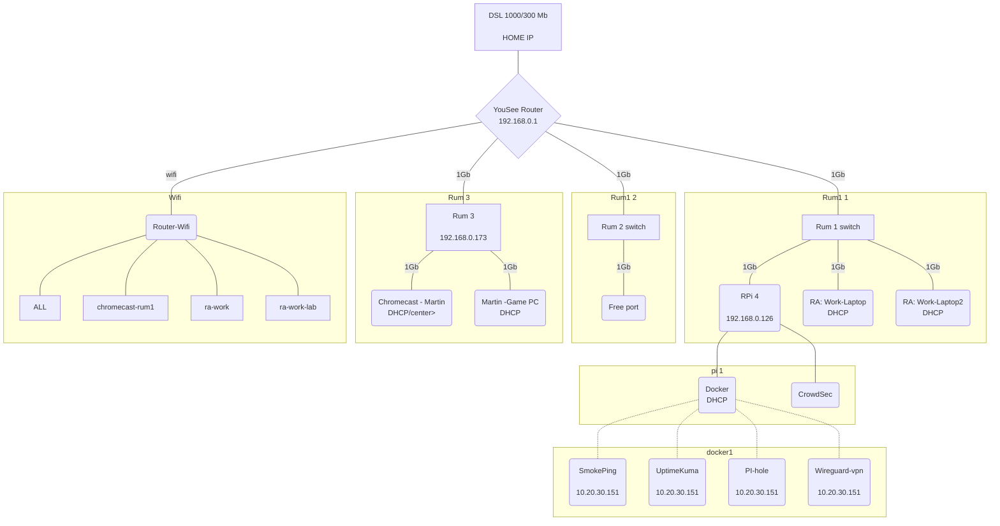

# Home Lab - Docomentation. 

```mermaid
graph TB
 linkStyle default interpolate basis
 wan1[<center>DSL 1000/300 Mb<br><br>HOME IP</center>]---router{<center>YouSee Router<br>192.168.0.1</center>}
 router---|1Gb|rum_1[<center>Rum 1 switch</center>]
 router---|1Gb|rum_2[<center>Rum 2 switch</center>]
 router---|1Gb|rum_3[<center>Rum 3<br><br>192.168.0.173</center>]
 router---|wifi|ac_wifi(<center>Router-Wifi</center>)

subgraph Rum1 1
rum_1---|1Gb|pi(<center>RPi 4<br><br>192.168.0.126</center>)
rum_1---|1Gb|work(<center>RA: Work-Laptop<br>DHCP</center>)
rum_1---|1Gb|work-lab(<center>RA: Work-Laptop2<br>DHCP</center>)
end

    subgraph pi 1
    pi---docker(<center>Docker<br>DHCP</center>)
    pi---crowdsec(<center>CrowdSec</center>)
    end

    subgraph docker1
    docker-.-smokeping(<center>SmokePing<br><br>10.20.30.151</center>)
    docker-.-uptimeKuma(<center>UptimeKuma<br><br>10.20.30.151</center>)
    docker-.-pihole(<center>PI-hole<br><br>10.20.30.151</center>)
    docker-.-wireguardvpn(<center>Wireguard-vpn<br><br>10.20.30.151</center>)
    end

subgraph Rum1 2
rum_2---|1Gb|free(<center>Free port</center>)
end

subgraph Rum 3
rum_3---|1Gb|chromecast-rum3(<center>Chromecast - Martin<br>DHCP/center>)
rum_3---|1Gb|gamer-pc(<center>Martin -Game PC<br>DHCP</center>)
end

subgraph Wifi
ac_wifi---ALL
ac_wifi---chromecast-rum1
ac_wifi---ra-work
ac_wifi---ra-work-lab
end

```