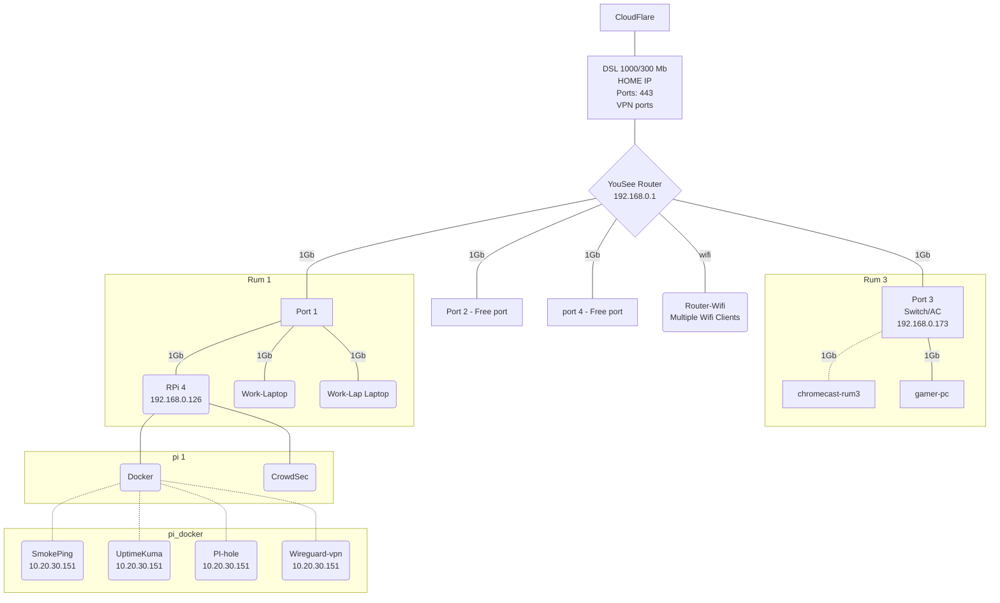

# Home Lab - Docomentation. 

Mostly a home network, but the Rasberry pi does make i out for my home lab. 
Besides that My "lab exists on my Labtop ad a virtual lab. 

The Raspberry på runs this services:
* Docker on the host
  * portainer, Docker admin.
  * pi-hole, DNS service and DNS filter
  * Smikeping, ping's local mashines
  * Uptime-Kuma, Thecks local and Work services. 
  * wg-easy, VPN vith wireguard
  * watchtower, offline, manualy run to update other Docker services. 
  * Swag, web proxy, cert manager(Let's encrypt) and websites
- Crowdsec on the Host, can read Docker logs and swag logs. 
The External IP has a web proxy though cloudflare. 
Some sites also has cloudflare logon. 

## See at grafical presentation of the NetWork
